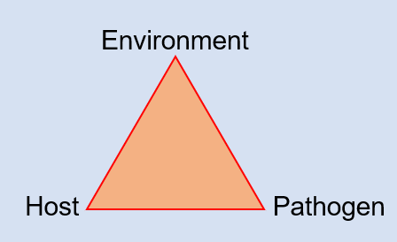
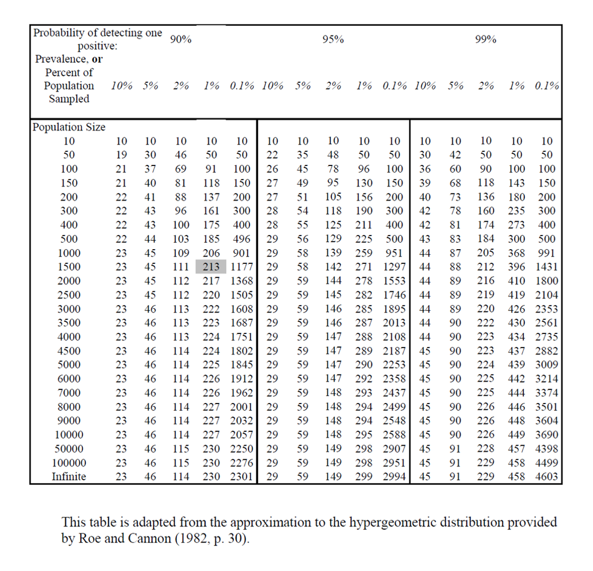
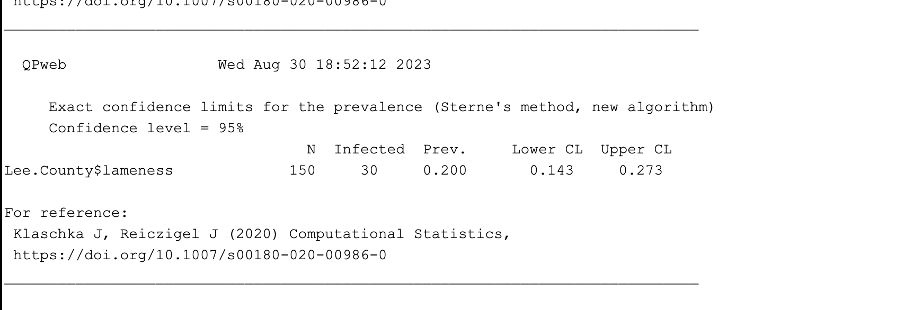
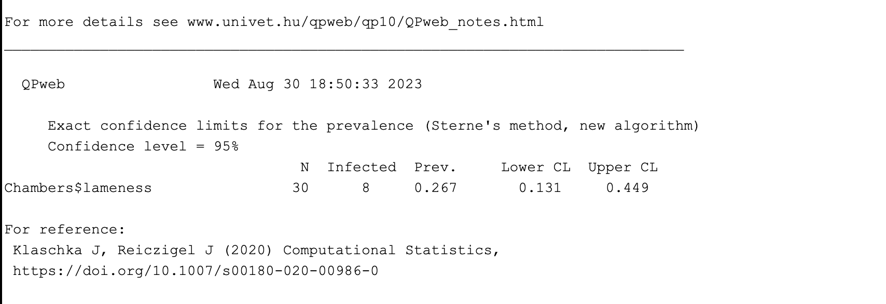
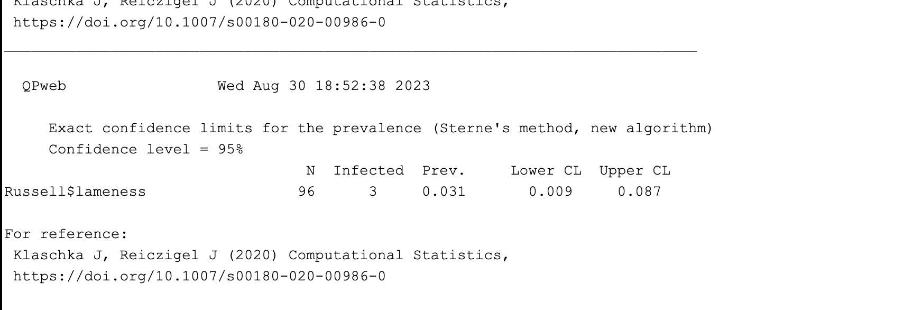

---
title: "Johns Rnotebook"
output: html_notebook
---

# - Lab 1 Aug. 23rd, 2023 -

({r, echo= FALSE} = no code in preview)


```{r, echo=FALSE}
#data: number of ticks found on dogs sampled from a shelter
tickdata <- c(0,0,0,0,1,0,6,0,3,3,5,22,0,0,3,33,4,2,1,23,7,2,4,6,78)
hist (tickdata, breaks = 90)
```



(**=bold *=italics)

# what is **happening** *italics*


# - Aug. 30th, 2023 lab 2 -


{width=80%}


## 1) 3/0.05 = 60 or if using the chart you get 59. 

## 2) At 95% confidence at 1% prevalence in a large population (using infinite) we see that you would need a sample size of **299**. On the other hand, with a confidence of 99% at 2% prevalence you would need a sample size of **229**. So you woulkd need a smaler sample size becasue of the larger prevalence. 

## 3) You sample 300 deer from a high fenced facility that has a herd of 4000. none of the 300 have antibodies against Epizootic Hemorrhagic Disease. Based on this finding, you are 95% confident that the prevalence of exposure to EHD in this facility is **<** (<,=,>,) **1%**.

## 4) 
## Lee County: 



## Chambers County:



## Russell County:




